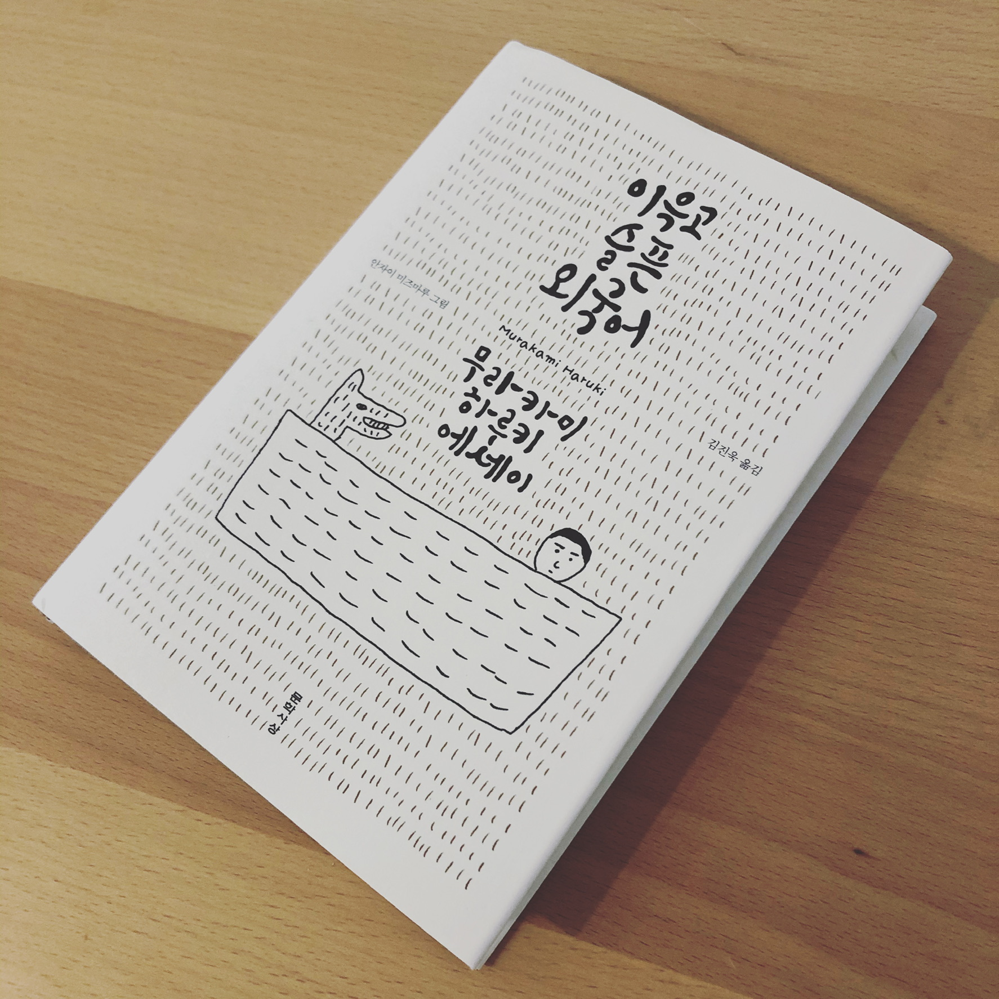

  

처가에서 생일 선물로 한국에서 보내주신 책이다. 다소 무뚝뚝한 집에서 자란 나로서는 선물을 주고 받는 문화가 생소하면서도 익숙해질 수록 점점 삶이 따뜻해지는 기분이다. 선물받은 책이니 어서 읽어야지 싶었지만, 워낙 가벼운 내용의 에세이인데다 텍스트 양도 많지 않아 굳이 노력해서 읽을 필요는 없었다. 오랜만에 한국어로 된 책을 읽으니, 마치 뻣뻣한 몸을 스트레칭 하는 것처럼 머리 속이 상쾌했다.

이 책은 저자가 90년대 초중반에 미국, 특히 프린스턴 지역에서 생활할 때의 에세이를 엮은 것이다. 제목이 ‘이윽고 슬픈 외국어’라서 영어가 어색한 일본인의 애환을 담은 이야기라 생각하기 쉽지만, 실상은 전혀 다르다. 무라카미 하루키라면 현대 일본의 대표적인 소설가지만, 한편으로 여러 명작 영문 소설을 일본어로 번역한 영향력 있는 번역가이기도 하다. 그는 어릴 적부터 미국 문화에 심취해 미국의 음악과 영화에 더불어 영문 소설도 잔뜩 읽었고, 공교육과 동떨어진 방식으로 스스로 영어를 익혔다. 미국 체류 중에는 프린스턴 대학에서 연구와 강의를 하며, 미국의 작가들과 교류를 나누고, 각종 사교 모임에 참가하는 등, 사실상 언어적인 불편함을 내비치지는 않는다. (나의 오해에서 비롯하여 전혀 합리화 할 수 없지만, 배신감을 느꼈다. 나의 마음이란 이다지도 감정에 가깝고 합리성에서 먼 것인가!)

불편함은 없지만, 그래도 외국어인지라 한번씩 대화가 어려운 순간들을 적어놓기도 했다. 이를테면, 미국인들이 활발히 대화를 나누는 자리에서 시간이 흐를 수록 집중력이 저하된다고 하는데, 그의 표현대로라면 ‘배터리가 나가는 증상’라고 한다. 매우 적절한 표현이라 동의하지 않을 수 없다. 하지만 이런 일도 제목이 일컫는 ‘슬픔’과는 거리가 있다.

영어로 하는 의사소통에 별다른 어려움이 없는 저자가 미국 생활에서 느꼈던 ‘슬픔’이란 일종의 ‘이방인성’에서 오는 것이었다. 문화적으로 격변의 시대였던 60~70년대를 통과해오며 ‘어딘지 쓸쓸한’ 개인주의를 깊이 계발한 그에게, 모국인 일본조차 완전한 소속감을 주지 못한다. 아마 그가 여러 유럽 국가와 미국을 전전했던 이유 중 하나일 지도 모른다. 언어적으로 큰 불편함이 없는 미국 생활 중에 그런 슬픔을 더 선명하게 느꼈을 것이다.

언제나 영어 능력을 길러야겠다고 생각하는 나로서는 힌트를 얻지 않을까 싶어서 이 책을 읽고 싶었다. 실상 회사 업무는 영어로 하고 있지만, 회사 동료의 대부분이 비영어권 국가 출신이라 다들 어렵지 않은 직설적인 영어로 의사소통을 하고 있고, 나는 그 안에서도 소통의 어려움을 겪고 있으니 말이다. 하지만 뜻밖에도 무라카미가 내비친 ‘이방인성’에서 공감을 하고 말았다. 나 역시 어디든 정착하지 못하고 여기저기 떠돌고 있으니 말이다. 자신을 향상할 기회를 찾아 떠났다고도 말할 수 있지만, 한편으로는 ‘여기가 아닌 새로운 곳에서의 삶’에 훌쩍 뛰어들만큼 기존의 삶에 큰 애착이 없었으니 말이다. 언젠가 정착할 날이 오긴 올테지만.

어쨌든, 거북이처럼 노력하는 인간 오준석은 오늘도 영단어를 외웠고, 이제부터는 나이 지긋한 영어 튜터가 보내준 The Economists의 글을 읽어야 한다. 한편으로는 무라카미 하루키가 영어에 서툴 때 그랬던 것처럼, 그저 내 구미에 당기는 영어 책을 골라서 거칠게 읽어볼까 싶다.

ps. 따지고 보면 Stephen Krashen이 주장해 유명한 인풋가설(the input hypothesis)의 살아있는 증거가 무라카미 하루키이다. 인풋가설은 워낙 유명하고, 지지자들마다 설명이 조금씩 다르므로 여기에 기술하진 않겠다. 다만, Krashen의 최근 강연에 따르면, 외국어를 배우는 가장 효과적인 방법이란 ‘어쩔 줄 모를 정도로 재미있는 책을 정신없이 읽는’ 것이다. 하루키의 사례를 보고 이론을 발전시킨게 아닐까 싶을 정도이다. 물론 사전에서 단어 뜻을 찾아야하고, 도무지 알 수 없는 문법은 따로 배워야겠지만.