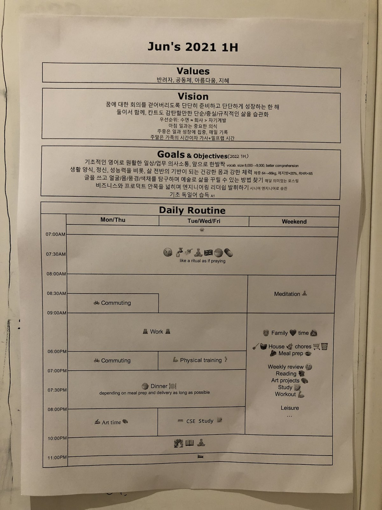

오늘은 2022년 1월 2일입니다. 어제는 꼬리에 꼬리를 무는 생각에 짓눌려 잠에 들 수 없었습니다. 생각의 주제는 일관성이 없어서 생각이 원천을 알 수 없었습니다. 다만 정신의 통일성을 잃고 불안을 느끼고 있다는 것만 알 수 있었습니다. 침대에 누워서 잠을 청하고 다시 일어나서 마음을 가라앉히길 반복하고, [천재 유교수의 생활](https://www.google.com/search?q=%EC%B2%9C%EC%9E%AC+%EC%9C%A0%EA%B5%90%EC%88%98%EC%9D%98+%EC%83%9D%ED%99%9C){:target="_blank"}([天才柳沢教授の生活](https://www.google.com/search?q=%E5%A4%A9%E6%89%8D%E6%9F%B3%E6%B2%A2%E6%95%99%E6%8E%88%E3%81%AE%E7%94%9F%E6%B4%BB){:target="_blank"})을 몇 권이나 읽고서는, 결국 새벽 5시가 되어야 의식을 놓고 망각 속으로 미끄러져 들어갈 수 있었습니다.

2021년의 마지막 한 주를 통채로 휴가로 보냈습니다. 한해를 마무리하면서 충분히 휴식하고, 미뤘던 일들을 마무리하고, 지나간 해를 돌이켜보고, 시작될 해를 계획하고 싶었습니다. 사실 근 몇년동안 계획이라고 할만한 건 단순하게 짜왔습니다. 목표와 과제는 꾸준히 비슷했기 때문에 예년의 계획을 아주 조금씩만 수정했습니다. 하지만 어쩐지 이번만큼은 아주 예전에 하던 것처럼 다소 치밀해지고 싶었습니다. 근 2~3년을 돌이켜보면 그림 연습과 창작에 불만족스러운 부분이 있었거든요. 꾸준히 자신을 성장시키는 단순한 생활 양식에서 멀어지고 있다는 생각도 있었습니다.

작업에 착수했습니다. 생각을 짜내고, 사유를 적은 문장을 지우고 또 적고, 시간표에서 타임 슬롯을 여기로 저기로 옮겼습니다. 하루에 여러 시간씩 투자해서 일주일을 들인 끝에, 새해 첫날에 A4 한장의 일일 계획표가 탄생했습니다. 간결하면서 필요한 내용을 충분히 담고 있고, 가독성도 좋았습니다. 현실성이 있으면서 시간효율도 높았습니다. 야근이나 의외의 사건으로 인한 유연성도 충분히 발휘할 수 있는 일정이었습니다. 나는 아내에게 나의 계획을 설명했습니다. 매년 짜오던 계획표와 크게 다르지 않았지만, 함축적이고 간결하다는 생각에 뿌듯했습니다. 과정에서 발견한 생각과 발상도 만족스러웠고요. 그렇게 나의 2022년 상반기 일일 계획표는 우리의 공부/작업방에 붙었습니다.

그러고는 극심한 불면에 시달렸습니다. 앞날의 계획을 세우는 일은 보통 만족감을 안겨주고 불안을 잠재우기 마련입니다. 때로는 현실성 없는 헛된 계획을 짜면서 마음의 위안을 얻기도 하죠. 하지만 이번만큼은 달랐습니다. 주제가 없는 다양한 생각에 짓눌리며 허탈함, 분노, 혼란 등의 감정 사이를 내달리는 정신으로는 잘 수 없습니다. 결국 침대를 벗어나 거실에 앉아 몸이 졸음을 견딜 수 없을 때가 되어서야 소파 위에서 잠들었고, 다섯 시간 남짓 잘 수 있었습니다. 약 12시간 전쯤의 일입니다. 오늘이 일요일이라 다행입니다.

늦은 오전에 깨어나서는 밥을 먹고 산책을 나갔습니다. 흐트러진 컨디션과 어지러운 마음을 다잡아야했습니다. 다행히 간밤의 두서없는 생각과는 다르게, 산책 길에서 든 생각은 하나였습니다. 계획에 문제가 있었습니다. 이대로는 결코 목표를 달성할 수 없을 것 같았습니다. 왜냐하면 그 계획 속에서 ***배우자의 존재감이 희박했기 때문***입니다. 나는 이제껏 대화와 이해의 부재로 파국에 이르는 다양한 관계들을 목도해왔습니다. 충분한 대화와 관용으로 좋은 관계를 쌓는 모습도 봐왔습니다. 그런데 슈프레 강 옆의 젖은 흙을 밟다가 불현듯 깨달은 겁니다. 배우자와 함께 서로의 성장을 고민하지 않고서는 개인의 성장도 없다는 것을요. 최근의 개인적 실패들은 사실 가장 가까운 사람과의 소통의 부재에서 기인한다는 것을요. 하지만 나의 계획표와 시간표에는 오직 나뿐이었습니다. 마치 혼자 살 때 짜놓은 것 같았습니다.

인간이 모여서 한데 산다는 건 어려운 일입니다. 개성이 뚜렷하고, 서로 살아온 생활양식이 다르다면 더욱이요. 세면대 위에 칫솔을 어떻게 놓는 지로도 싸움이 가능한 것이 부부입니다. 함께 살기 위해서는, 더욱이, 밀접한 관계를 맺고 살기 위해선 개인의 일이라도 서로 협력해야 합니다. 가족은 같은 공간에서 서로의 시간을 공유하니까요.

엑셀 시트를 열고 부족한 부분을 찾았습니다. 나의 바람과 계획 사이의 연결고리가 전혀 보이지 않았습니다. 그러니 당위성도 전달될 것 같지 않았습니다. 이대로라면 어째서 이런 계획과 일정이 나왔는지 보는 사람이 이해하기 어려울 것입니다. 그래서 추상적인 바람과 구체적인 목표를 추가하고, 이 바람과 계획에 아내를 넣었습니다. 그제서야 이 계획이 성공하고 꿈을 이루기 위해서 아내와 어떤 대화를 나누고 어떤 이해를 구해야 하는지 알 것 같았습니다. 다시 A4 용지 한장 분량의 계획과 시간표가 나왔습니다. 바라는 바와 행동 사이의 빈틈이 메워졌습니다. 아내를 위하는 점도 강조되었죠. 간결함은 줄었지만 장황하진 않습니다. 하지만 간결함을 찾는 순간 사고의 디테일은 소실됩니다. 서로 기존에 품고 있는 이해도 다르겠죠. 그러니 어떻게든 역시 꾸준한 대화가 필요합니다.

혼자만의 계획이라면 다양한 소프트웨어 도구를 사용하면 되죠. 요즘 워낙 생산성 도구들의 품질이 좋으니까요. 하지만 계획표를 출력하게 된 당초의 의도가 있었습니다. 그걸 잊고 있었죠. 서로가 서로의 계획을 보면서 삶의 패턴을 맞춰가는 게 목적이었거든요. 그래서 이번 계획표는 방이 아니라 욕실 옆 복도에 붙였습니다. 오가는 길에 보면서 상기할 수 있게요. 

일요일이지만 아내는 밀린 업무를 보러 출근을 했습니다. 내가 잠에서 깨기도 전에 집에서 나서는 모습을 배웅하지도 못했습니다. 집에 오면 따뜻한 저녁이 그를 맞이하고 있을 겁니다. 저녁을 들면서 나의 생각과 요구를 전하고 그의 의사를 들어야겠습니다. 더불어 자신에게 어떤 성장을 기대하는지, 내게 원하는 바도 물어야겠습니다. 아내도 자기조직력을 키우고 스스로 원하는 인간으로 성장하길 바라니까요. 서로가 서로에게 가장 든든한 후원자가 되길 바랍니다.

새해 목표와 계획을 앞에 두고 가슴이 벅차지는 않습니다. 그저 담담히 실천을 다짐합니다. 그러면 세상이 조금 더 투명하게 느껴집니다. 아내의 귀가가 기다려집니다. 이제 불안하지 않습니다.