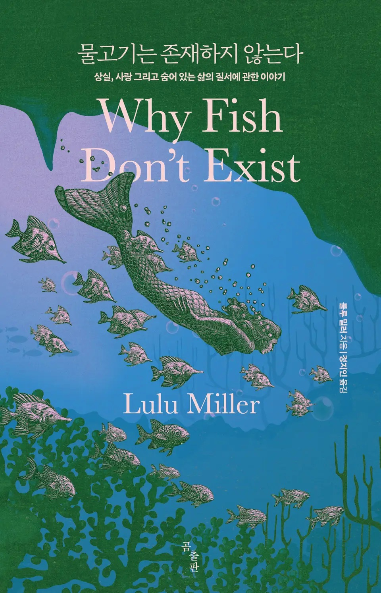

  

최근에 본 가장 아름다운 엔딩이었다. 몇 년에 걸친 취재의 시작은 작가의 삶이었고, 자연스레 그 끝도 작가의 삶이었다. 지식과 진리는 그 자체로 아름답지만, 각각의 사람에게 제각각의 삶을 부여한다. 사람들이 찾아내는 “저마다의 삶의 의미”라고도 부를 수 있을 것 같다.

난 마지막 챕터 끝부분에 큰언니를 위해 남겨놓은 한 문단이 가장 좋았다. 그녀는 어째서 ‘소위’ 똑똑한 사람들이 새로운 사실을 받아들이기 힘들어하는지를 이미 알고 있었다. 그리하여 사람들이 서로를 괴롭히게 된다는 것도.

르포와 에세이를 섞어놓은 구성도 흥미롭다. 에세이 파트가 르포를 진행시키는 원동력이 되면서, 결국 르포의 내용이 에세이를 결론짓는 근거가 되는 흐름이 감탄스럽다. 불변의 진리는 최고의 선이 아니며, 진리를 쫓는 동기는 인간의 마음에서 나오고, 이전의 진리를 파괴해야 다음 진리에 도달할 수 있으며, 진리는 삶에 의미를 부여하며 가치를 가진다-는 내용의 구조와도 통한다.

언젠가 나도 내 삶의 의미를 다루는 책을 쓸 수 있을까?

#물고기는존재하지않는다 #책

—

It was the most beautiful ending I’ve seen in a while. The beginning of a years-long investigation was the writer’s life, and naturally, the end was the writer’s life. Knowledge and truth are beautiful in themselves, but they give each person a life of their own. We could call it the various meanings of life that people find for themselves.

My favorite part was the paragraph at the end of the last chapter, which is left for the eldest sister. She already knew why “so-called” smart people have a hard time accepting new facts, and that’s why people end up bullying each other.

It’s also interesting how the book is mixed with the reportage and the essay. I’m impressed with the way the essay part drives the reportage forward, and the reportage’s content eventually becomes the basis for the essay’s conclusion. The structure of the essay is consistent with the following themes: immutable truth is not the highest good, the motivation to pursue truth comes from the human mind, the destruction of previous truths is necessary to reach the next truth, and truth gives meaning to life and has value.

Can I write a book about the meaning of my life, one day?

#whyfishdontexist #book
